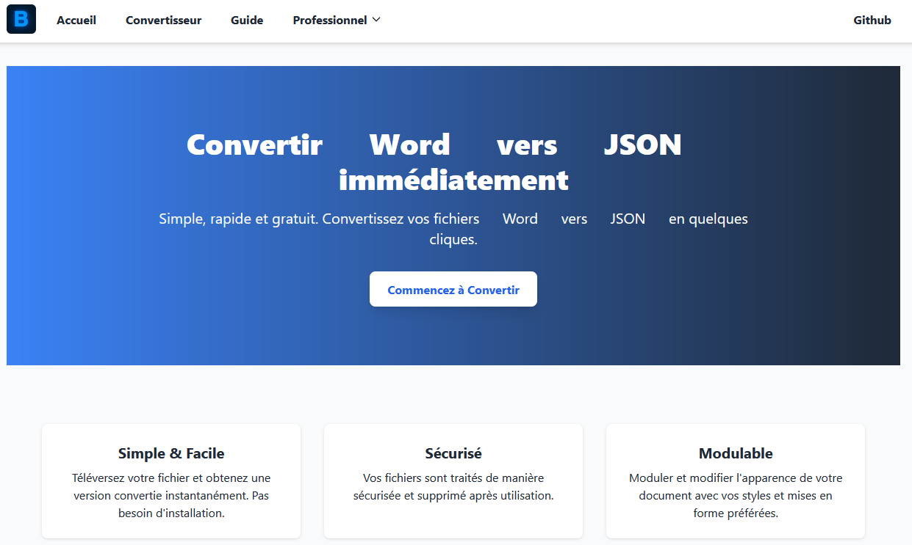
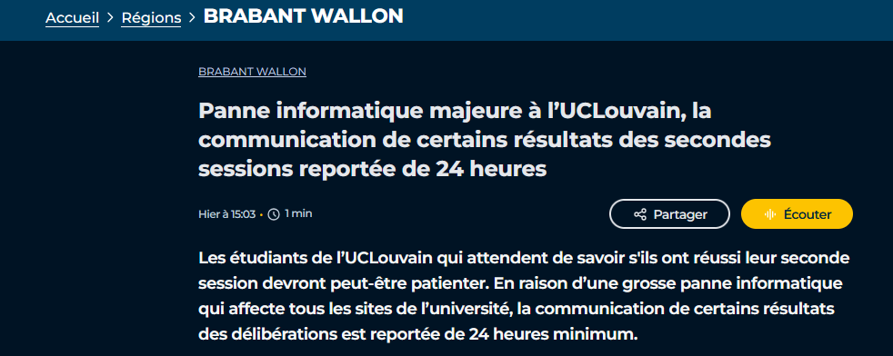
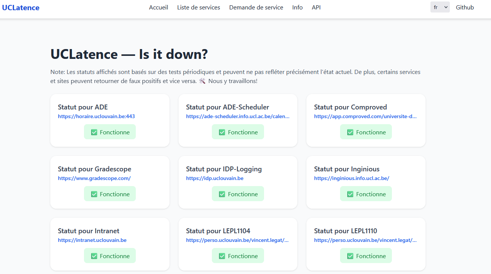

After finishing my internship at NXP, I took a break... until my brain couldn't handle the boredom. So I pulled back my long list of ideas to make me a billionaire (*spoiler: the ideas are all trash but fun*). Among the ideas was: "**Make a simple conversion tool using Pandoc**". *Oh sh\*t, are we go again...*

# Free, Simple, Fast Online Conversion tool

Yes, there exists around a quadrillion of those websites, but let's face it, they look all sketchy and you don't know if your confidential data are used for other ends. Moreover, I've been a big user of [pandoc](https://pandoc.org/), a marvelous simple command line utility tool which converts in many, many, ... formats. It is as simple as:

```sh
pandoc hello.docx -o hello.md
```

Which is a wonderful way to get rid of Microsoft 365 ecosystems ([blog](https://www.antipope.org/charlie/blog-static/2013/10/why-microsoft-word-must-die.html)). Under the hood, pandoc is converting in $\LaTeX$ when you convert in pdf, another reason to love it. 

The tool is already incredible like this, but it truly shines when you pair it with template and use variable which allows for clean and flexible documents that fits through various support (ideal for online publishing ;) ). And so one command can become more and more exotic as used and demonstrated in my recent [KULeuven's Summaries](https://github.com/Tfloow/Q8_KUL).

```bash
pandoc summary.md LICENSE.md -o $@.pdf --template eisvogel --listings --number-sections
```

Here, we can **combine** markdown together to make it one large file and then use the beautiful template *eisvogel*, then get cleaner code block and number sections using the extra arguments. But, it is hard to replicate the setup and that's when docker comes into play. The  `pandoc/extra` docker has already a ton of beautiful templates packed with it. Moreover, the community has been quite active publishing templates for presentation, invoice, ... all available at [pandoc-templates.org](https://pandoc-templates.org/).

## Packing all the of it

This is where pandoc really shines, when you start combining everything together. But with increased flexibility and capabilities comes an increased complexity. No one can remember all those long command and can just spend 30 minutes just to compile 1 file. Pairing it with a nice makefile is the way to go.

But this is not enough, this is still too "tech-savy". I want everyone to see and appreciate the power of pandoc without downloading a single applications or opening any terminal. A webapp was the best bet.

This is how https://beconvert.onrender.com/ was born. It is deployed on Render with the free plan which means the app can take a bit of time to start when it was shutdown. But the core principles are there. Behind, a simple docker runs which is a Debian based server that runs my flask app and install extra dependencies to have all the templates installed.



With a sleek and modern design using Tailwind CSS made in ChatGPT. (Yes I suck at UI/UX, I am a backend dev and I have no sense of color theory)

Anyone can convert their file using https://beconvert.onrender.com/conversion . It can be quite slow to compile as the ressources allocated are minimal. But if a significant demand appears I may work more on the premium plan to cover hosting costs.

## Becoming RICHHH

Yes, I mentioned it was a free app but I also said this idea was in my `get_rich_fast_quick.txt` list. Of course, the average user can use it for free but it also has paid premium features for companies.

Basically, it can create clean invoice at https://beconvert.onrender.com/invoice . You can feed in a CSV looking like:

| Part ID | Description                          | Quantity | Price per Piece | Price |
| :------ | :----------------------------------- | :------: | :-------------: | ----: |
| XXXX    | Something really cool and overpriced |    2     |      1.000      | 2.000 |

Then it will use a $21\%$ VAT (welcome to Belgium) and will sum up everything and add the VAT. It is still a work in progress so it may have more or less features (if I become greedy).

A tool to create shipping label and professional looking business card is in the work. Of course, to get more features one can purchase a premium key. It is not yet perfect as the template I use is in markdown/Latex and it struggles to be translated in word. And I am an *ethical* business man so I won't sell yet until I'm satisfied with my features.

## Final note

Please have fun, upload your documents, they will be deleted after a maximum of 2 hours and they are stored in a docker container so it should be quite secluded from the rest. Also, the code is open-source for anyone that is doubting of the security, so please take a look!

The docker image is available on the docker hub [here](https://hub.docker.com/repository/docker/tfloow/beconvert/general). It may not always be up to date so check the github for the latest Dockerfile [here](https://github.com/Tfloow/Beconvert).

# One Last Dance

After getting a *friendly email from UCL\*uvain* (name redacted) that warns me that if I don't shut down UCL\*uvain-down I may get in trouble. This project was explained [here](https://thomas.debelle.be/2024-06-19-Uclouvain-Down/) (yes I had to change the picture). If you are too lazy to read the old blog post, I made with a friend a web service that monitor the status of the biggest french-speaking University in Belgium. I did it for fun and to understand how basic monitoring works and play with API, ... It was a really fun project and I learned a lot. For over a year and half we didn't got any issues and it was reporting status of websites as expected. Then all of a sudden I receive that email that asked me to shutdown the website for several reasons:

- Copyright infringements:
  - Logo and name of the University without rightful license
- Trying to impersonate the Univeristy using a similar url (www.ucl\*uvain-down.be again redacted)

Fair enough, it's their rights and the policy for the logo usage is a bit crazy [link](https://www.uclouvain.be/fr/universite/logo). But it's their right of course. I just found it sad to shutdown a student project instead of encouraging them and assessing the need for such tool in their vast IT infrastructure.

## Big Bang Theory

Fast-forward to 4th of September:



The whole IT infrastructure of the University suffers from a significant outage and results must be delayed for 24 hours. I swear I was not behind it. It was most likely an update that prevented the services or server to start as normal and supposing everything is held by one single infrastructure, everything was down for several hours.

So, I said "One Last Dance"

## One Last Dance

I pull my git that I left untouched for several months, renamed the website to UCLatence and removed all reference or usage of the logo. I bought a new URL https://www.uclatence.be . Now, no one can accuse me of unlawful copyright usage. I again re-vamped the interface to give a fresh new look using Tailwind CSS and deploy it again on render:



In less than a hour I manage to re-establish my old project, comply with the request that was formulated by the head of IT. I hope this site will be up for good, and maybe one day ? it could be part of the IT of this University.

## Final word

I found it quite sad for an university that strive for creativity and re-inventing itself to abruptly shut down student's creation. Was I inline with the copyright rules ? No, of course but why not trying to collaborate with student, try to create and polish something with them. But also listen to them ? Many students had complaints about the availability of the tools and a poor crisis management. To communicate that the website was down, a few instagram stories were used ... this is far too little for worried students that are waiting for their results.

This is why I still believe that this project could bring serenity to students. Yes, they have an internal tool like this but why not making it public ? This would avoid many hassles and emails.

If anyone from UCL\*uvain is reading this, I stay open to discuss about it as always. You know where to reach me :))

# Last touch

I am now entering my final year at KULeuven and already working on my Master's thesis. Of course, I will keep this blog alive and I hope I will have more freetime to create such projects in the future.

I wish everyone a wonderful academic year, filled with meaningful connections, joy, sweats and much more.